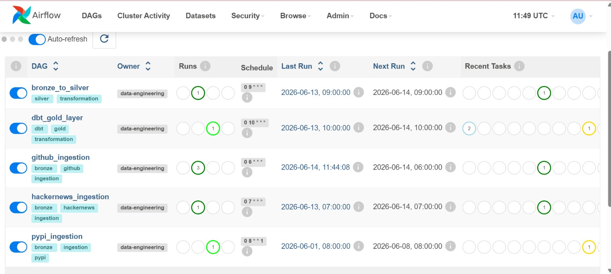
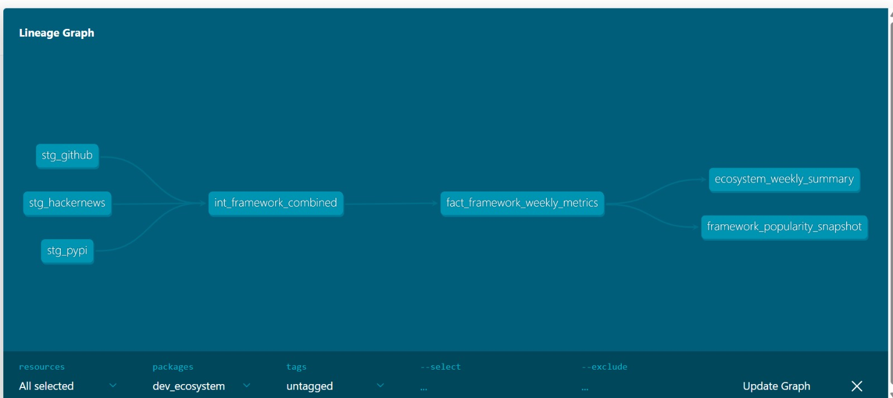

# Developer Ecosystem Analytics Platform


> A production-grade data platform that ingests live data from GitHub, HackerNews, and PyPI to track technology adoption trends, framework popularity shifts, developer sentiment, and ecosystem health — the kind of intelligence Atlassian, JetBrains, or any developer-tool company would actually pay for.

---

## 📊 Business Questions This Platform Answers

- Which frameworks are **growing vs dying** based on real developer activity?
- What are developers **excited about right now** on HackerNews?
- Which libraries are being **abandoned** (PyPI download drops + GitHub inactivity)?
- What should an engineering team **learn next quarter**?

---

## 🏗️ Architecture

**Data Sources → Ingestion → Storage → Transformation → Consumption**

| Stage | Tools | Output |
|---|---|---|
| **Sources** | GitHub API, HackerNews API, PyPI Stats | Raw JSON |
| **Ingestion** | Python + Requests + pypistats | Snowflake BRONZE |
| **Orchestration** | Apache Airflow (Docker) | Scheduled DAGs |
| **Processing** | Pandas | Snowflake SILVER |
| **Transformation** | dbt-snowflake | Snowflake GOLD |
| **Quality** | Great Expectations | Validation Reports |
| **AI Layer** | GPT-4o API | Trend Report |
| **Dashboard** | Streamlit | Interactive Charts |
| **CI/CD** | GitHub Actions | Auto Testing |

### Airflow Orchestration



Airflow orchestrates ingestion, transformation, and Gold-layer model execution through scheduled DAGs.

### Framework Trend Analysis



Framework popularity and ecosystem health are tracked using GitHub activity, PyPI downloads, and HackerNews engagement.


Business-ready Gold models generated through dbt transformations. These tables combine GitHub activity, PyPI download trends, and HackerNews engagement into unified framework metrics, ecosystem summaries, and historical popularity snapshots for analytics and decision-making.

**Pipeline Flow:**

`GitHub API` + `HackerNews API` + `PyPI API`
→ **Python Ingesters** (rate limiting, DLQ, schema drift)
→ **Snowflake BRONZE** (raw append-only)
→ **Pandas Transformation** (clean, deduplicate, normalise)
→ **Snowflake SILVER** (typed, standardised)
→ **dbt Models** (composite scores, SCD Type 2)
→ **Snowflake GOLD** (business metrics)
→ **Streamlit Dashboard** + **GPT-4o Report**

---

## 🛠️ Complete Tech Stack

| Layer | Tool | Version | Purpose |
|---|---|---|---|
| **Ingestion** | Python + Requests | 3.11.9 | API calls, pagination, rate limiting |
| **Ingestion** | pypistats | 1.13.0 | PyPI download stats |
| **Orchestration** | Apache Airflow | 2.8.1 | DAG scheduling, monitoring |
| **Containerisation** | Docker + Compose | 29.2.1 | Local Airflow setup |
| **Processing** | Pandas | 2.1.4 | Bronze → Silver transformation |
| **Transformation** | dbt-snowflake | 1.11.5 | Silver → Gold business logic |
| **Storage** | Snowflake Enterprise | Latest | Medallion Architecture |
| **Data Quality** | Great Expectations | 0.18.15 | Bronze validation |
| **AI Layer** | GPT-4o API | Latest | Auto trend report generation |
| **Dashboard** | Streamlit | 1.31.0 | Interactive visualisation |
| **CI/CD** | GitHub Actions | Latest | Automated testing on push |

---

## 🗄️ Data Sources

| Source | Signal | Schedule | Volume |
|---|---|---|---|
| **GitHub Public API** | Stars, forks, commits, PR merge rate, issue resolution | Daily | 15 repos |
| **HackerNews Algolia API** | Story count, avg score, sentiment | Daily | 19 keywords |
| **PyPI Stats API** | Weekly downloads, growth rate | Weekly | 15 packages |

---
## 🏅 Medallion Architecture (Snowflake)

| Layer | Bronze (Raw) | Silver (Clean) | Gold (Business) |
|---|---|---|---|
| **GitHub** | GITHUB_REPOS_RAW | FACT_GITHUB_WEEKLY | FACT_FRAMEWORK_WEEKLY_METRICS |
| **GitHub** | GITHUB_EXTENDED_RAW | — | ECOSYSTEM_WEEKLY_SUMMARY |
| **HackerNews** | HACKERNEWS_POSTS_RAW | FACT_HN_WEEKLY | FRAMEWORK_POPULARITY_SNAPSHOT (SCD Type 2) |
| **PyPI** | PYPI_DOWNLOADS_RAW | FACT_PYPI_WEEKLY | — |
---

## 📈 Composite Scoring Model

| Score | Formula |
|---|---|
| **Popularity Score** | GitHub Stars (35%) + PyPI Downloads (25%) + Commits 30d (20%) + HN Story Count (20%) |
| **Sentiment Score** | HN Sentiment (50%) + Issue Resolution Rate (30%) + PR Merge Rate (20%) |
| **Health Index** | Popularity Score (40%) + Sentiment Score (30%) + Commit Velocity (20%) + Issue Debt (10%) |

All scores normalised 0–1 using min-max scaling.

---

## 🔧 Production Patterns Implemented

| Pattern | Implementation |
|---|---|
| **Incremental Loads** | High-water mark from MONITORING.INGESTION_LOG |
| **Dead Letter Queue** | Failed records → ERROR.DLQ_RECORDS with auto-retry |
| **Schema Drift Detection** | Validates API response against expected_schemas.yaml |
| **Exponential Backoff** | 3 retries with 2s, 4s, 8s delays on API failures |
| **Rate Limit Handling** | Reads X-RateLimit headers, sleeps until reset |
| **Row Count Anomaly** | Compares to 7-day rolling average, alerts on deviation |
| **SCD Type 2** | dbt snapshot tracks framework rank changes over time |
| **Run Logging** | Every pipeline run logged to MONITORING.INGESTION_LOG |

---
## 📁 Project Structure

```
developer-ecosystem-analytics/
├── ingestion/
│   ├── github/            ← GitHub API ingester
│   ├── hackernews/        ← HackerNews Algolia ingester
│   ├── pypi/              ← PyPI Stats ingester
│   └── utils/             ← Shared utilities (DLQ, anomaly, schema)
├── processing/
│   └── bronze_to_silver/  ← Pandas transformation pipeline
├── transformation/
│   └── dev_ecosystem/     ← dbt project
│       ├── models/
│       │   ├── staging/        ← Views on Silver tables
│       │   ├── intermediate/   ← Joined models
│       │   └── marts/          ← Gold business metrics
│       └── snapshots/          ← SCD Type 2
├── orchestration/
│   ├── dags/              ← 5 Airflow DAGs
│   └── docker-compose.yml
├── quality/
│   └── expectations/      ← Great Expectations validation
├── ai_layer/              ← GPT-4o trend report
├── dashboard/             ← Streamlit dashboard
├── .github/
│   └── workflows/         ← GitHub Actions CI/CD
└── config/
    ├── expected_schemas.yaml
    ├── framework_keywords.yaml
    └── pypi_packages.yaml
```

---

## 🚦 Airflow DAGs

| DAG | Schedule | What It Does |
|---|---|---|
| `github_ingestion` | Daily 6AM | Pulls 15 GitHub repos metadata + extended metrics |
| `hackernews_ingestion` | Daily 7AM | Pulls HN stories for 19 framework keywords |
| `pypi_ingestion` | Weekly Monday 8AM | Pulls PyPI weekly download stats |
| `bronze_to_silver` | Daily 9AM | Cleans and transforms Bronze → Silver |
| `dbt_gold_layer` | Daily 10AM | Builds Gold metrics, runs tests, updates SCD Type 2 |

---

## ✅ dbt Models

| Model | Layer | Type | Description |
|---|---|---|---|
| `stg_github` | Staging | View | Clean GitHub Silver data |
| `stg_hackernews` | Staging | View | Clean HN Silver data |
| `stg_pypi` | Staging | View | Clean PyPI Silver data |
| `int_framework_combined` | Intermediate | View | Joins all 3 sources |
| `fact_framework_weekly_metrics` | Marts | Table | Composite scores per framework |
| `ecosystem_weekly_summary` | Marts | Table | Weekly top framework summary |
| `framework_popularity_snapshot` | Snapshot | Table | SCD Type 2 history |

**Tests: 15/15 passing**

---

## 🎯 Frameworks Tracked

| Category | Frameworks |
|---|---|
| **Web** | FastAPI, Flask, Django, httpx |
| **Data** | Pandas, NumPy, PyPI Stats |
| **ML** | PyTorch, TensorFlow, scikit-learn |
| **Data Engineering** | Airflow, dbt, Spark, Great Expectations |
| **Dev Tools** | Streamlit, Pydantic |

---

## 🔍 Key Findings (Live Data — June 2026)

| Framework | Health Index | Insight |
|---|---|---|
| TensorFlow | 0.501 | Highest overall health |
| PyTorch | 0.456 | 212M weekly downloads — production standard |
| NumPy | 0.333 | Most downloaded Python package on the planet |
| dbt | 0.336 | Low stars but 19M downloads — silently dominating |
| httpx | 0.179 | Sentiment 0 — community attention declining |

---

## 🚀 How to Run Locally

### Prerequisites
- Python 3.11
- Docker Desktop
- Snowflake account (free trial)

### Setup

```bash
# Clone the repo
git clone https://github.com/preranavichare01/developer-ecosystem-analytics.git
cd developer-ecosystem-analytics

# Install dependencies
pip install -r requirements.txt

# Configure credentials
cp config/.env.example config/.env
# Fill in your Snowflake, GitHub token credentials

# Run ingestion
python ingestion/github/github_ingester.py
python ingestion/hackernews/hn_ingester.py
python ingestion/pypi/pypi_ingester.py

# Run transformation
python processing/bronze_to_silver/bronze_to_silver.py

# Run dbt Gold layer
cd transformation/dev_ecosystem
dbt run
dbt test

# Start Airflow
cd orchestration
docker compose up -d
# Open http://localhost:8081 (admin/admin)

# Run data quality checks
python quality/expectations/validate_bronze.py
```

---

## 🎤 System Design Interview Topics This Project Covers

| Topic | Implementation |
|---|---|
| Medallion Architecture | Bronze → Silver → Gold in Snowflake |
| Incremental Data Loading | High-water mark pattern in INGESTION_LOG |
| Dead Letter Queue | ERROR.DLQ_RECORDS with retry DAG |
| Schema Evolution | Schema drift detection + YAML contracts |
| SCD Type 2 | dbt snapshot on framework popularity |
| Data Quality | Great Expectations on Bronze ingestion |
| Pipeline Observability | MONITORING schema with run logs + anomaly detection |
| Rate Limit Handling | X-RateLimit header reading + exponential backoff |

---

## 👤 Author

**Prerana Vichare**
Data Engineer  @ Capgemini

Passionate about building scalable data platforms, cloud-native ETL pipelines, and analytics solutions. Experienced in Python, SQL, PySpark, Snowflake, Databricks, Azure, and Generative AI applications.

Currently advancing expertise in data engineering, distributed systems, modern data architecture, and large-scale analytics.


[](https://github.com/preranavichare01)